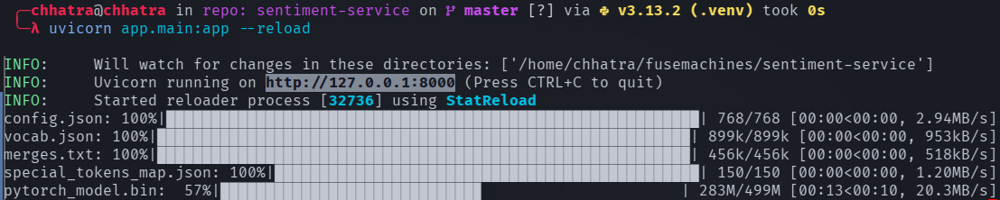
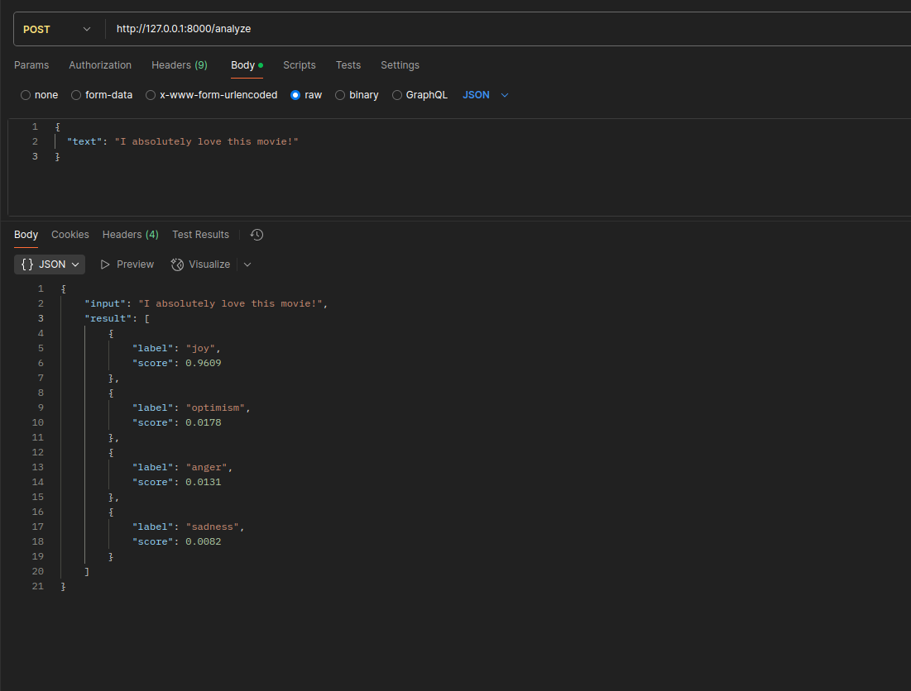
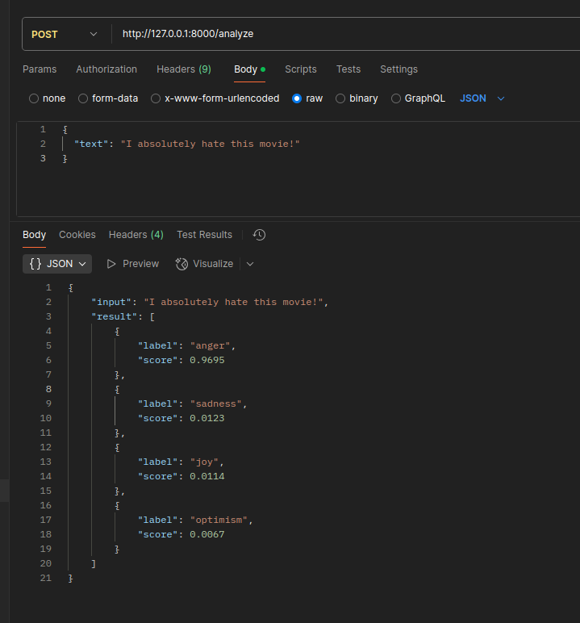
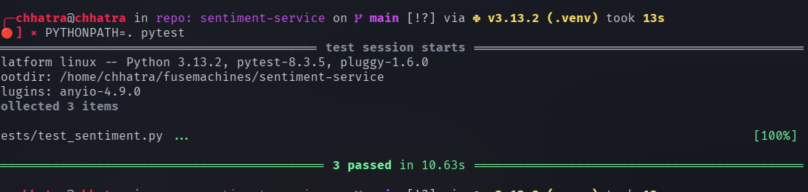

# 🤖 Sentiment Analysis using Huggingface

A powerful sentiment analysis tool built using Huggingface Transformers. This project classifies text into **positive**, **negative**, or **neutral** sentiments using pre-trained transformer models like BERT. It is designed for developers, researchers, and anyone interested in analyzing the sentiment of textual data.

---Resetting  password for 650000011894980
7:55
Compliance Automation
650000011894980  has been locked.







Compliance Automation
Compliance AutomationAPP  8:52 AM

## ✨ Features

- 🔍 Real-time Sentiment Prediction using Huggingface Transformers
- 🧠 Pretrained BERT/DistilBERT Models
- 🌐 REST API with FastAPI (or Flask)
- 🐳 Docker & Docker Compose support
- ✅ Unit tests for robustness
- ⚡ Easy deployment and integration

---

## 🚀 Getting Started

Follow these instructions to get the project up and running on your local machine.

### 🧰 Prerequisites

Ensure the following tools are installed on your machine:

- **Python 3.9 or later**  
  [Download Python](https://www.python.org/downloads/)

- **Pip** (Python package manager)  
  Usually installed with Python  
  [Install pip](https://pip.pypa.io/en/stable/installation/)

- **Docker & Docker Compose (Optional)**  
  Recommended for easy setup and deployment  
  [Install Docker](https://docs.docker.com/get-docker/)  
  [Install Docker Compose](https://docs.docker.com/compose/install/)

---

### 🛠 Installation

1. **Clone the Repository:**

```bash
git clone https://github.com/shahchhatru/sentiment-service.git
cd sentiment-service
```

2. **Install Dependencies:**

```bash
pip install -r requirements.txt
```

3. **Setup Environment Variables**
```bash
cp .env.example .env
```

Edit the .env file if needed (e.g., API key or port). Most use cases work without changes.

4. **Run the Application:**
```bash
uvicorn app.main:app --reload
```


5. **🐳 Docker & Docker Compose**
```bash
docker build -t sentiment-app .
docker run -p 8000:8000 --env-file .env sentiment-app
```

```bash
docker-compose up --build
docker-compose up -d
docker-compose down
```

## 🛠️ Usage

Once the server is running, you can access the sentiment analysis API.

### 📡 API Endpoint

**POST** `/analyze`

### 📝 Request Body

```json
{
  "text": "I love this product!"
}
```
## 📷 Screenshots

### ✅ Model Loading


### 📊 Analysis Result


### 📥 Output Example


### 🧪 Test Passed


## 📹 Sentiment Analysis with Hugging Face

[](https://www.youtube.com/watch?v=h3nHjQHByNA)

Click the thumbnail above to watch the full video on YouTube.


